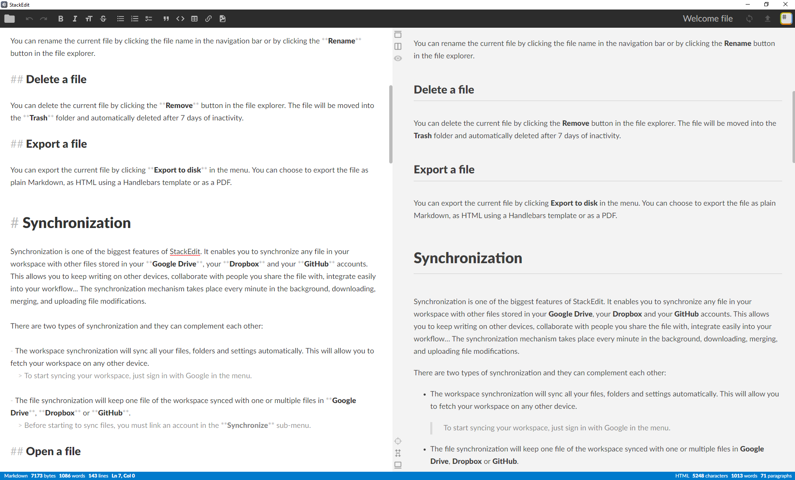

<!-- Logo -->
<p align="center">
  <a href="https://github.com/SanjaySunil/StackEdit-desktop">
    
  </a>
</p>

<!-- Title -->
<h1 align="center">StackEdit-Desktop</h1>
  <p align="center">
    An unofficial desktop app for StackEdit.
    <br />
    <a href="">Report Bug</a>
    ·
    <a href="">Request Feature</a>
  </p>
</h1>
<br/><br/>

<!-- Preview -->
<p align="center">
  <a href="">
    
  </a>
  <!-- Drop Shadow -->
  <a href="">
    
  </a>
</p>
<br/>

<!-- Information -->

## What's StackEdit desktop?

**StackEdit desktop** is an unofficial electron desktop app for<a href="https://stackedit.io/"> StackEdit</a>. This app loads the StackEdit web editor into a browser window using the Electron framework. You can find the official source code of the editor [here](https://github.com/benweet/stackedit).
<br/>

<!-- Installation -->

## Installation

1. Clone StackEdit Desktop
```sh
git clone https://github.com/sanjaysunil/stackedit-desktop
```

2. Install node_modules
```sh
npm install
```

3. Start the application!
```sh 
npm start
```
<br/>

<!-- Build -->

## Build

Build for Windows
```sh
npm run win:build
```

Build for MacOS, Linux and Windows
```sh
npm run build
```
<br/>

<!-- ROADMAP -->

## Roadmap

See the [open issues](https://github.com/SanjaySunil/StackEdit-desktop/issues) for a list of proposed features (and known issues).
<br/>

<!-- CONTRIBUTING -->

## Contributing

Contributions are what make the open source community such an amazing place to be learn, inspire, and create. Any contributions you make are **greatly appreciated**.

1. Fork the Project
2. Create your Feature Branch (`git checkout -b feature/Feature`)
3. Commit your Changes (`git commit -m 'Added a new Feature'`)
4. Push to the Branch (`git push origin feature/Feature`)
5. Open a Pull Request
<br/>

## License

Copyright © 2020 Sanjay Sunil (sanjaysunil@protonmail.com)

Distributed under the MIT License. See `LICENSE` for more information.
